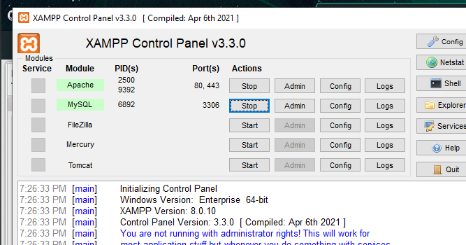
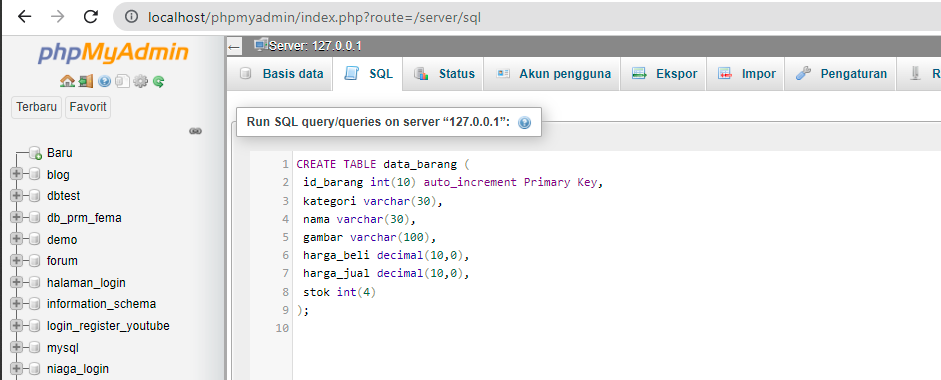
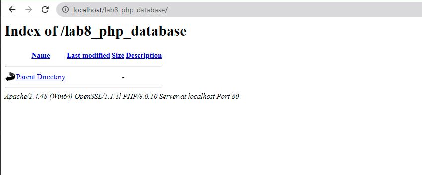
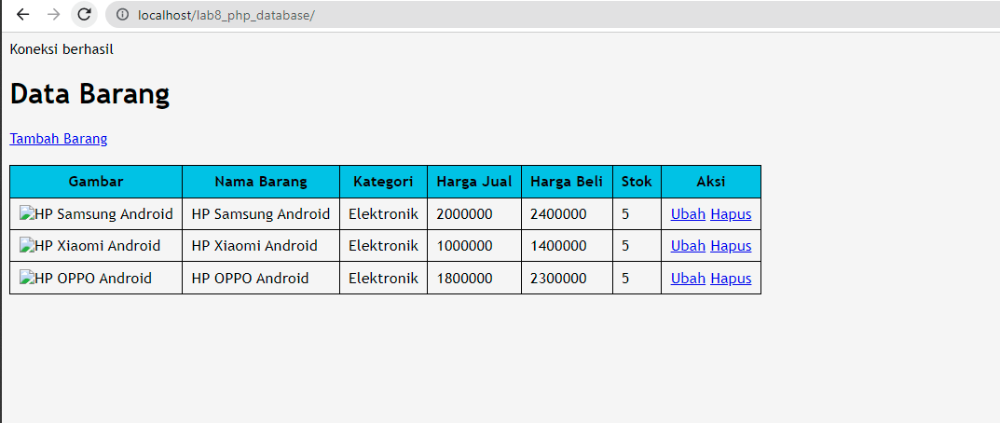
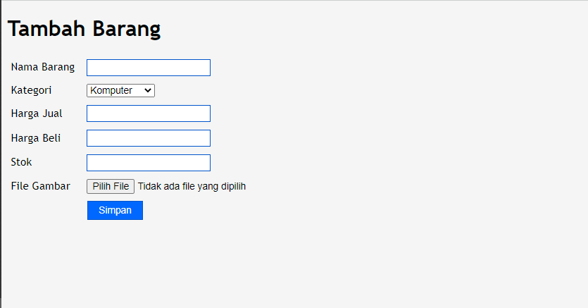

# Tugas Lab 8 Web
## Profil
| # | Biodata |
| -------- | --- |
| **Nama** | Faris Aryano Pirsada|
| **NIM** | 312010371 |
| **Kelas** | TI.20.A.2 |
| **Mata Kuliah** | Pemrograman Web |

# Praktikum 8: PHP dan Database MySQL

## Instruksi Praktikum
1. Persiapkan text editor misalnya VSCode.
2. Buat folder baru dengan nama lab8_php_database pada docroot webserver 
(htdocs)
3. Ikuti langkah-langkah praktikum yang akan dijelaskan berikutnya.
Langkah-langkah Praktikum
Persiapan
Untuk memulai membuat aplikasi CRUD sederhana, yang perlu disiapkan adalah 
database server menggunakan MySQL. Pastikan MySQL Server sudah dapat dijalankan 
melalui XAMPP.

## Menjalankan MySQL Server
Untuk menjalankan MySQL Server dari menu XAMPP Contol.


## Mengakses MySQL Client menggunakan PHP MyAdmin
Pastikan webserver Apache dan MySQL server sudah dijalankan. Kemudian buka 
melalui browser: `http://localhost/phpmyadmin/`

## Membuat Database: Studi Kasus Data Barang
* Dengan menggunakan tabel seseorang dapat dengan mudah mengetahui berbagai perubahan (menaik atau menurun) yang telah berlangsung dalam suatu masalah.

1. Membuat Database
```
CREATE DATABASE latihan1;
```

2. Membuat Tabel
```
CREATE TABLE data_barang (
 id_barang int(10) auto_increment Primary Key,
 kategori varchar(30),
 nama varchar(30),
 gambar varchar(100),
 harga_beli decimal(10,0),
 harga_jual decimal(10,0),
 stok int(4)
);
```


3. Menambahkan Data
```
INSERT INTO data_barang (kategori, nama, gambar, harga_beli, harga_jual, stok)
VALUES ('Elektronik', 'HP Samsung Android', 'hp_samsung.jpg', 2000000, 2400000, 5),
('Elektronik', 'HP Xiaomi Android', 'hp_xiaomi.jpg', 1000000, 1400000, 5),
('Elektronik', 'HP OPPO Android', 'hp_oppo.jpg', 1800000, 2300000, 5);
```
* klik menu sql lalu salin code sql ini..

## Membuat Program CRUD
* Buat folder lab8_php_database pada root directory web server (d:\xampp\htdocs)


1. Kemudian untuk mengakses direktory tersebut pada web server dengan mengakses URL: 
http://localhost/lab8_php


2. Membuat file koneksi database
Buat file baru dengan nama `koneksi.php`
```
<?php
$host = "localhost";
$user = "root";
$pass = "";
$db = "latihan1";
$conn = mysqli_connect($host, $user, $pass, $db);
if ($conn == false) {
 echo "Koneksi ke server gagal.";
 die();
} #else echo "Koneksi berhasil";
?>
```
* atau bisa menggunakan code simple
```
<?php
$conn = mysqli_connect('localhost', 'root', '', 'latihan1');
if(!$conn){
    echo "koneksi keserver gagal.";
    die();
}else{
    echo "koneksi berhasil"
}
?>
```
3. Buka melalui browser untuk menguji koneksi database (untuk menyampilkan pesan 
koneksi berhasil, uncomment pada perintah echo “koneksi berhasil”;


4. Membuat file index untuk menampilkan data (Read)
Buat file baru dengan nama `index.php`
```
<?php
include("koneksi.php");

$sql = 'SELECT * FROM data_barang';
$result = mysqli_query($conn, $sql);

?>
<DOCTYPE html>
<html lang="en">
<head>
    <meta charset="UTF-8">
    <link href="style.css" rel="stylesheet" type="text/css" />
    <title>Data Barang</title>
</head>
<body>
    <div class="container">
        <h1>Data Barang</h1>
        <tr>
            <a href="tambah.php?id=">Tambah Barang</a>
        </tr>

        <div class="main">
            <table border="1" cellpadding="5" cellspacing="0">
            <tr>
                <th>Gambar</th>
                <th>Nama Barang</th>
                <th>Katagori</th>
                <th>Harga Jual</th>
                <th>Harga Beli</th>
                <th>Stok</th>
                <th>Aksi</th>
            </tr>
            <?php if($result): ?>
            <?php while($row = mysqli_fetch_array($result)): ?>
            <tr>
                <td><?= $row['nama'];?></td>
                <td><?= $row['nama'];?></td>
                <td><?= $row['kategori'];?></td>
                <td><?= $row['harga_beli'];?></td>
                <td><?= $row['harga_jual'];?></td>
                <td><?= $row['stok'];?></td>
                <td>
                    <a href="ubah.php?id=<?= $row['id_barang'];?>">Ubah</a>
                    <a href="hapus.php?id=<?= $row['id_barang'];?>">Hapus</a>
                </td>
            </tr>
            <?php endwhile; else: ?>
            <tr>
                <td colspan="7">Belum ada data</td>
            </tr>
            <?php endif; ?>
            </table>
        </div>
    </div>
</body>
</html>
```
* lalu kita kasih css agar kelihatan rapih buat file baru `style.css` dalam 1 folder
```
table{
    border-collapse:collapse;
    font-family:'Lucida Sans', sans-serif;
    color:#000000
}
table th{
    background:#eb41a4;
    color:#0a0000;
    font-weight:bold;
    font-size:14px;
}
table th, td{
    vertical-align:top;
    padding:5px 10px;
    border:1px solid #000000;
}
table tr{
    background:#FFF;
}
table tr:nth-child(even){
    background:#FFF;
}
```


5. Menambah Data (Create)
Buat file baru dengan nama `tambah.php`
* dengan penggunaan include_once() atau require_once() maka berarti penyisipan hanya di panggil sekali saja.
* error_reporting(E_ALL); // memunculkan report error 
```
<?php
error_reporting(E_ALL);
include_once 'koneksi.php';

if (isset($_POST['submit']))
{
    $nama = $_POST['nama'];
    $kategori = $_POST['kategori'];
    $harga_jual = $_POST['harga_jual'];
    $harga_beli = $_POST['harga_beli'];
    $stok = $_POST['stok'];
    $file_gambar = $_FILES['file_gambar'];
    $gambar = null;
    if ($file_gambar['error'] == 0)
    {
        $filename = str_replace(' ', '_',$file_gambar['name']);
        $destination = dirname(__FILE__) .'/gambar/' . $filename;
        if(move_uploaded_file($file_gambar['tmp_name'], $destination))
        {
            $gambar = 'gambar/' . $filename;;
        }
    }
    $sql = 'INSERT INTO data_barang (nama, kategori,harga_jual, harga_beli, stok, gambar) ';
    $sql .= "VALUE ('{$nama}', '{$kategori}','{$harga_jual}', '{$harga_beli}', '{$stok}', '{$gambar}')";
    $result = mysqli_query($conn, $sql);
    header('location: index.php');
}
?>
<!DOCTYPE html>
<html lang="en">
<head>
    <meta charset="UTF-8">
    <meta http-equiv="X-UA-Compatible" content="IE=edge">
    <meta name="viewport" content="width=device-width, initial-scale=1.0">
    <link href="tambahstyle.css" rel="stylesheet" type="text/css" />
    <title>Tambah Barang</title>

    <style>
        body {
            background-color: #FFF;
        }
    </style>
</head>
<body>
    <div class="container">
        <h1><center>Tambah Barang</h1></center>
    <div class="main">
        <form method="post" action="tambah.php" enctype="multipart/form-data">
            <table border="0" align="center">
                <tr>
                    <div class="input">
                        <td>Nama Barang</td>
                        <td>:</td>
                        <td><input type="text" name="nama" /></td>
                    </div>
                </tr>
                <div class="input">
                    <td>Kategori</td>
                    <td>:</td>
                    <td><select name="kategori">
                        <option value="Komputer">Komputer</option>
                        <option value="Elektronik">Elektronik</option>
                        <option value="Hand Phone">Hand Phone</option>
                        </select>
                    </td>
                </div>
                </tr>
                <div class="input">
                    <td>Harga Jual</td>
                    <td>:</td>
                    <td><input type="text" name="harga_jual" /></td>
                </div>    
                </tr>
                <div class="input">
                    <td>Harga Beli</td>
                    <td>:</td>
                    <td><input type="text" name="harga_beli" /></td>
                </div>  
                </tr>
                <div class="input">
                    <td>Stok</td>
                    <td>:</td>
                    <td><input type="text" name="stok" /></td>
                </div>
                </tr>
                <div class="input">
                    <td>File Gambar</td>
                    <td>:</td>
                    <td><input type="file" name="file_gambar" /></td>
                </div>
                </tr>
                <div class="submit">
                    <td><input type="submit" name="submit" value="Simpan" /></td>
                </div>
                </tr>
            </table>
        </form>
    </div>
    </div>
</body>
</html>
```


6. Mengubah Data (Update)
Buat file baru dengan nama `ubah.php`
```
<?php
error_reporting(E_ALL);
include_once 'koneksi.php';

if (isset($_POST['submit']))
{
    $id = $_POST['id'];
    $nama = $_POST['nama'];
    $kategori = $_POST['kategori'];
    $harga_jual = $_POST['harga_jual'];
    $harga_beli = $_POST['harga_beli'];
    $stok = $_POST['stok'];
    $file_gambar = $_FILES['file_gambar'];
    $gambar = null;

    if ($file_gambar['error'] == 0)
    {
        $filename = str_replace(' ', '_', $file_gambar['name']);
        $destination = dirname(__FILE__) . '/gambar/' . $filename;
        if (move_uploaded_file($file_gambar['tmp_name'], $destination))
        {
            $gambar = 'gambar/' . $filename;;
        }    
    }

    $sql = 'UPDATE data_barang SET ';
    $sql .= "nama = '{$nama}', kategori = '{$kategori}', ";
    $sql .= "harga_jual = '{$harga_jual}', harga_beli = '{$harga_beli}', stok
    = '{$stok}' ";
    if (!empty($gambar))
         $sql .= ", gambar = '{$gambar}' ";
    $sql .= "WHERE id_barang = '{$id}'";
    $result = mysqli_query($conn, $sql);   
    
    header('location: index.php');
}

//$id = $_GET['id']; --> Ini tidak akan mendapatkan hasil atau value
$id = (isset($_POST['id']) ? $_POST['id'] : ''); // karena ingin mendapatkan form dengan methot post.
$sql = "SELECT * FROM data_barang WHERE id_barang = '{$id}'";
$result = mysqli_query($conn, $sql);
if (!$result) die('Error: Data tidak tersedia');
$data = mysqli_fetch_array($result);

function is_select($var, $val) {
    if ($var == $val) return 'selected="selected"';
    return false;
}

?>
<!DOCTYPE html>
<html lang="en">
<head>
    <meta charset="UTF-8">
    <meta http-equiv="X-UA-Compatible" content="IE=edge">
    <meta name="viewport" content="width=device-width, initial-scale=1.0">
    <title>Ubah Barang</title>
    <link rel="stylesheet" href="style.css">
</head>
<body>
    <div class="container">
        <h1>Ubah Barang</h1>
        <div class="main">
        <form method="post" action="ubah.php"
         enctype="multipart/form-data">
         <div class="input">
             <label>Nama Barang</label>
             <input type="text" name="nama" value="<?php echo
            $data['nama'];?>" />
         </div>
         <div class="input">
             <label>Kategori</label>
             <select name="kategori">
                <option <?php echo is_select
                ('Komputer', $data['kategori']);?> value="Komputer">Komputer</option>
                <option <?php echo is_select
                ('Komputer', $data['kategori']);?> value="Elektronik">Elektronik</option>
                <option <?php echo is_select
                ('Komputer', $data['kategori']);?> value="Hand Phone">Hand Phone</option>
             </select>
         </div>
         <div class="input">
             <label>Harga Jual</label>
             <input type="text" name="harga_jual" value="<?php echo
              $data['harga_jual'];?>" />
         </div>
         <div class="input">
             <label>Harga Beli</label>
             <input type="text" name="harga_beli" value="<?php echo
              $data['harga_beli'];?>" />
         </div>
         <div class="input">
             <label>Stok</label>
             <input type="text" name="stok" value="<?php echo
             $data['stok'];?>" />
         </div>
         <div class="input">
             <label>File Gambar</label>
             <input type="file" name="file_gambar" />
         </div>
         <div class="submit">
           <input type="hidden" name="id" value="<?php echo
           $data['id_barang'];?>" />
           <input type="submit" name="submit" value="Simpan" />
         </div>
     </form> 
     </div>
    </div>
</body>
</html>
```

7. Menghapus Data (Delete)
Buat file baru dengan nama `hapus.php`
```
<?php
include_once 'koneksi.php';
$id = $_GET['id'];
$sql = "DELETE FROM data_barang WHERE id_barang = '{$id}'";
$result = mysqli_query($conn, $sql);
header('location: index.php');
?>
```

## Laporan Praktikum
1. Buatlah repository baru dengan nama Lab8Web.
2. Kerjakan semua latihan yang diberikan sesuai urutannya.
3. Screenshot setiap perubahannya.
4. Buatlah file README.md dan tuliskan penjelasan dari setiap langkah praktikum 
beserta screenshotnya.
5. Commit hasilnya pada repository masing-masing.
6. Kirim URL repository pada e-learning ecampus


## ENJOY NGODING